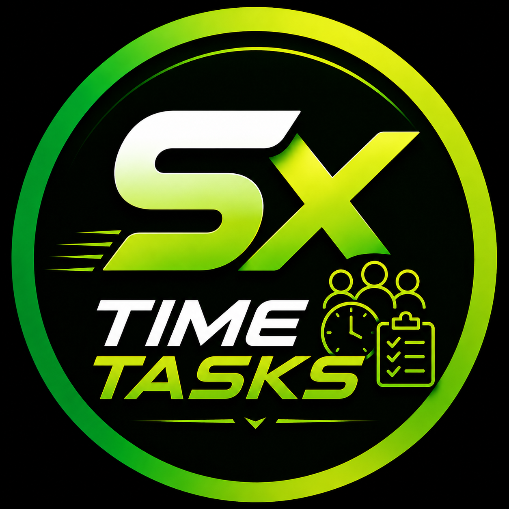

# SX Time Tasks

Aplicativo privado de agenda, tarefas e reservas com a assistente SX, autenticação Supabase e deploy no EasyPanel.



## Estado atual

- Versão: `2.0.0`
- Produção: [startups-timetasks.qfotry.easypanel.host](https://startups-timetasks.qfotry.easypanel.host/)
- Runtime: Node.js 22 em Docker/EasyPanel
- Dados: Supabase self-hosted com PostgreSQL, Auth e RLS
- IA: SX via endpoint autenticado no servidor; a chave do provedor não chega ao navegador
- Modo demonstração: removido

## Funcionalidades entregues

- Login e criação de conta por e-mail e senha.
- Lista privada de membros do aplicativo (`time_tasks_members`).
- Calendário em Dia, 3 Dias, Semana e Mês.
- CRUD de eventos, cinco calendários e verificação de conflitos.
- Tarefas/Sementes com prazo, lembrete, conclusão, edição e exclusão.
- SX por texto e voz para criar eventos, tarefas e lembretes.
- Páginas públicas de agendamento, horários, reservas e cancelamento.
- Preferências persistentes: perfil, tema, fuso, calendários, IA e alertas.
- Som no horário do lembrete enquanto o aplicativo estiver aberto.
- Notificação do navegador quando a permissão estiver ativa.
- Versículos pela manhã e à tarde, com histórico antirrepetição por usuário.
- Identidade visual preta, verde e amarelo-neon baseada na marca SX.
- Manifesto web e ícone do aplicativo.

## Arquitetura

```text
Navegador
  ├─ Supabase Auth + REST (anon key pública + JWT do usuário)
  ├─ /api/sx (JWT + vínculo time_tasks_members + limite de requisições)
  └─ /api/verse (JWT + vínculo time_tasks_members)

Servidor Node
  ├─ arquivos de dist/
  ├─ chave privada da IA somente no ambiente
  └─ cabeçalhos CSP, Permissions-Policy e proteção de conteúdo

Supabase
  ├─ Auth
  ├─ tabelas public.time_tasks_*
  └─ RLS por auth.uid()
```

As tabelas do Time Tasks usam o prefixo `time_tasks_*`. Isso evita colisões com o SevenChat e outros produtos existentes no mesmo PostgreSQL. A tabela legada `public.sx_messages` do SevenChat não é alterada.

### Limite de isolamento atual

Dados, APIs e acesso ao Time Tasks estão isolados por namespace, vínculo de membro e RLS. O serviço Supabase/Auth ainda é fisicamente compartilhado com outros produtos no servidor. Uma instância Supabase dedicada continua no roadmap caso seja exigido isolamento físico de banco, Auth, chaves e infraestrutura.

## Banco de dados

O arquivo [`supabase/schema.sql`](./supabase/schema.sql) é idempotente e cria:

- `time_tasks_members`
- `time_tasks_events`
- `time_tasks_settings`
- `time_tasks_seeds`
- `time_tasks_booking_pages`
- `time_tasks_bookings`
- `time_tasks_sx_messages`
- `time_tasks_verse_deliveries`

Todas as oito tabelas têm RLS ativo. O schema também migra eventos da antiga `public.events` quando ela existir, sem apagar ou modificar a origem.

## Desenvolvimento local

Requisitos: Node.js 22+ e npm.

```bash
npm ci
npm run dev
```

Para simular o runtime de produção:

```bash
npm run build
PORT=3000 \
SUPABASE_URL="https://seu-supabase" \
SUPABASE_ANON_KEY="sua-anon-key" \
GEMINI_API_KEY="sua-chave-privada" \
npm start
```

O frontend usa `VITE_SUPABASE_URL` e `VITE_SUPABASE_ANON_KEY`. A anon key é pública por definição; service-role, senha do banco, token do EasyPanel, token do GitHub e chave da IA nunca devem ser colocados no frontend ou versionados.

## Validação

```bash
node --check server.js
for file in js/*.js; do node --check "$file"; done
npm run build
npm audit --omit=dev
git diff --check
```

O gate funcional também inclui login real, RLS, eventos, tarefas, reservas públicas, SX, versículos, healthcheck e teste visual das abas.

## Documentação

- [Manual de uso](./MANUAL_DE_USO.md)
- [Roadmap e falhas corrigidas](./ROADMAP.md)

## Fontes externas usadas pelo produto

- IA: [Google Gemini API](https://ai.google.dev/api)
- Versículos: [bible-api.com](https://bible-api.com/)
- Tipografia: [Inter](https://fonts.google.com/specimen/Inter)
